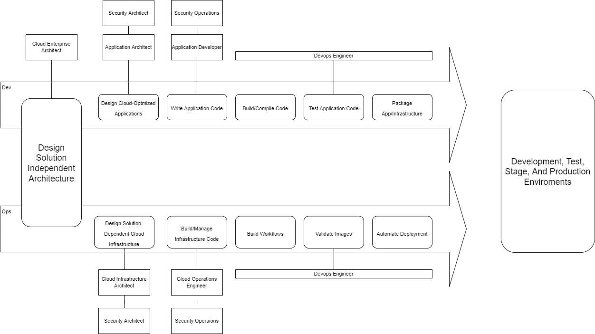

# Cloud Roles and Infrastructure as Code

Manual and Automated Management

- Manual

  - AWS Management Console
  - AWS CLI
  - AWS APIs

 

- Automated (using IaC):
  - Provides a reusable, maintainable, extensible, and testable infrastructure.

 

Why use Infrastructure as Code?

- Infrastructure as Code

  - A practice in which infrastructure is provided and managed using code and software development techniques, such as versioning control and continuous integration and delivery

- Codify Desings

- Rapidly iterate on Designs

- Easy to maintain

- Easily add company security best practices

